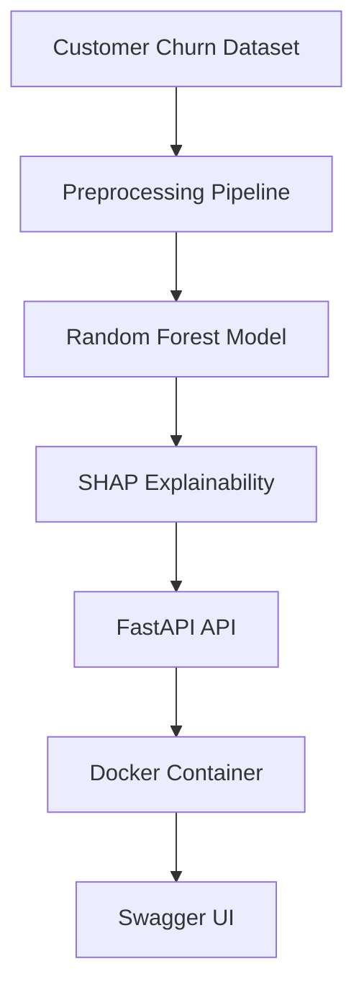

# Customer Churn Prediction

An end-to-end machine learning project that predicts customer churn using a dataset containing 1 million customer records. The project demonstrates data preprocessing, feature engineering, model development, explainability, API deployment, and containerization.

## Overview

Customer churn is a critical business problem because retaining existing customers is often less expensive than acquiring new ones. This project builds predictive models to identify customers at risk of leaving and exposes the final model through a production-style API.

## Tech Stack

* Python
* Pandas
* NumPy
* Scikit-Learn
* XGBoost
* SHAP
* FastAPI
* Docker

## Project Workflow

## Architecture



### Data Preparation

* Data cleaning and preprocessing
* Missing value handling
* Feature engineering
* Categorical encoding
* Pipeline-based transformations

### Model Development

Models evaluated:

* Logistic Regression
* Random Forest
* XGBoost

Performance was assessed using:

* Precision
* Recall
* F1 Score
* ROC-AUC
* Confusion Matrix

### Explainability

SHAP was used to interpret model predictions and identify the features with the strongest impact on churn risk.

### Deployment

The final model is exposed through a FastAPI application and containerized using Docker.

## Results

| Model               | ROC-AUC |
| ------------------- | ------- |
| Logistic Regression | ~0.62   |
| Random Forest       | ~0.67   |
| XGBoost             | ~0.68   |
| Top-10 Feature RF   | ~0.66   |

## API Example

Request:

```json
{
  "customer_satisfaction": 4,
  "num_service_calls": 3,
  "num_complaints": 2,
  "monthlycharges": 85,
  "totalcharges": 2000,
  "days_since_signup": 400,
  "annual_income": 50000,
  "credit_score": 650,
  "days_since_last_interaction": 30,
  "contract": "month_to_month"
}
```

Response:

```json
{
  "prediction": 1,
  "churn_probability": 0.79
}
```

## Running the Project

Install dependencies:

```bash
pip install -r requirements.txt
```

Start the API:

```bash
uvicorn src.api:app --reload
```

Open Swagger documentation:

```text
http://localhost:8000/docs
```

Docker:

```bash
docker build -t customer-churn-api .
docker run -p 8000:8000 customer-churn-api
```

## Skills Demonstrated

* Machine Learning Pipelines
* Feature Engineering
* Model Evaluation
* Explainable AI (SHAP)
* FastAPI
* Docker
* Model Deployment
